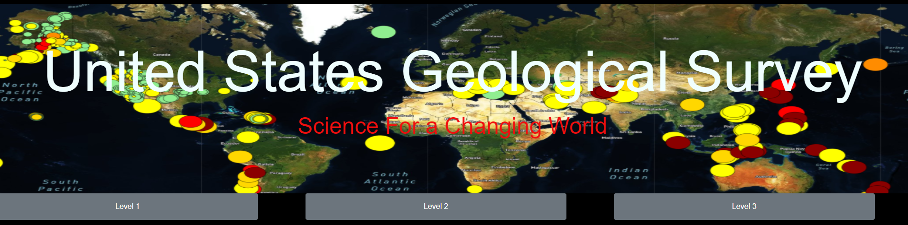
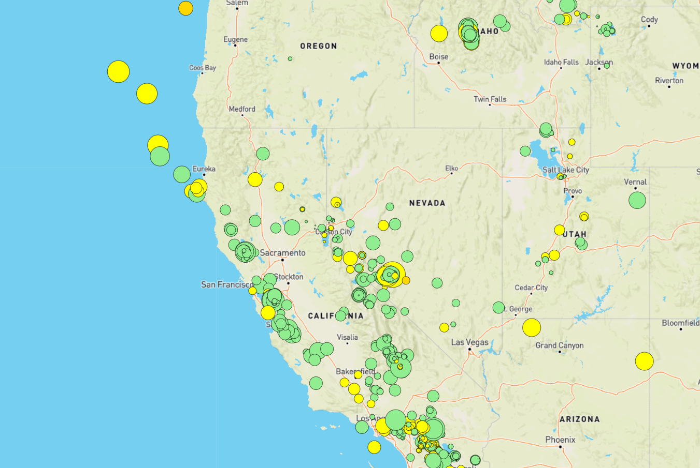
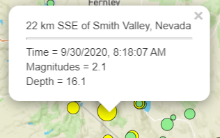
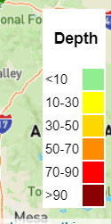
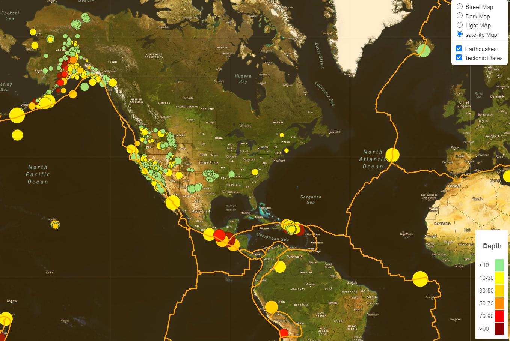

# Leaflet Homework - Visualizing Data with Leaflet

## Background

Welcome to the United States Geological Survey, or USGS for short! The USGS is responsible for providing scientific data about natural hazards, the health of our ecosystems and environment; and the impacts of climate and land-use change. Their scientists develop new methods and tools to supply timely, relevant, and useful information about the Earth and its processes. As a new hire, you will be helping them out with an exciting new project!

The USGS is interested in building a new set of tools that will allow them visualize their earthquake data. They collect a massive amount of data from all over the world each day, but they lack a meaningful way of displaying it. Their hope is that being able to visualize their data will allow them to better educate the public and other government organizations (and hopefully secure more funding..) on issues facing our planet.

### Level 1: Basic Visualization

My first task was to visualize an earthquake data set.

1. **Getting the data set**

   

   The USGS provides earthquake data in a number of different formats, updated every 5 minutes. 
   [USGS GeoJSON Feed](http://earthquake.usgs.gov/earthquakes/feed/v1.0/geojson.php) .
   I picked up 'All Earthquakes Data from the Past 7 Days'. I was given a JSON representation of that data by link and then I used the URL of this JSON to pull in the data for our visualization.

   

2. **Import & Visualize the Data**

   * I created a map using Leaflet that plots all of the earthquakes from the data set based on their longitude and latitude.

   * My data markers reflect the magnitude of the earthquake by their size and and depth of the earth quake by color. Earthquakes with higher magnitudes appear larger and earthquakes with greater depth appear darker in color.

   * I included popups that provide additional information about the earthquake when a marker is clicked.

   * I created a legend that will provide context for my map data.

   
- - -

### Level 2: More Data (Tectonic Plates Data)

The USGS wanted me to plot a second data set on my map to illustrate the relationship between tectonic plates and seismic activity. I pulled in a second data set from <https://github.com/fraxen/tectonicplates> and visualize it along side my original set of data. 

In this step :

* I plotted  a second data set on my map.

* I added a number of base maps to choose from as well as separate out my two different data sets into overlays that can be turned on and off independently.

- - -

### Level 3: More Data , More Layer And More Challenges 

While I was doing this Project I put myself in more challenges again. I saw the plots are overlapping each other and they are not clear for the users. So, I decided to to categorize my data base on "Magnitudes".

In this Step:

* I separated out the Earthquake data sets into overlays based on "Magnitudes". 
* The overlays can be turned on and off independently as well as the "tectonic plates" data set is available too.

The final project can be viewed at :<https://nima-karimii.github.io/leaflet-challenge/>
### Hope you Enjoy it

